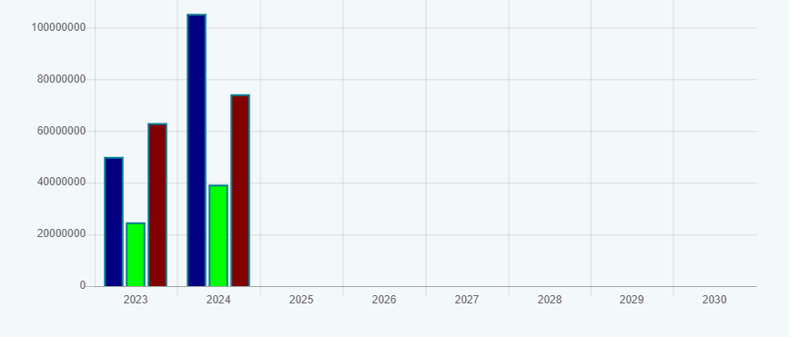
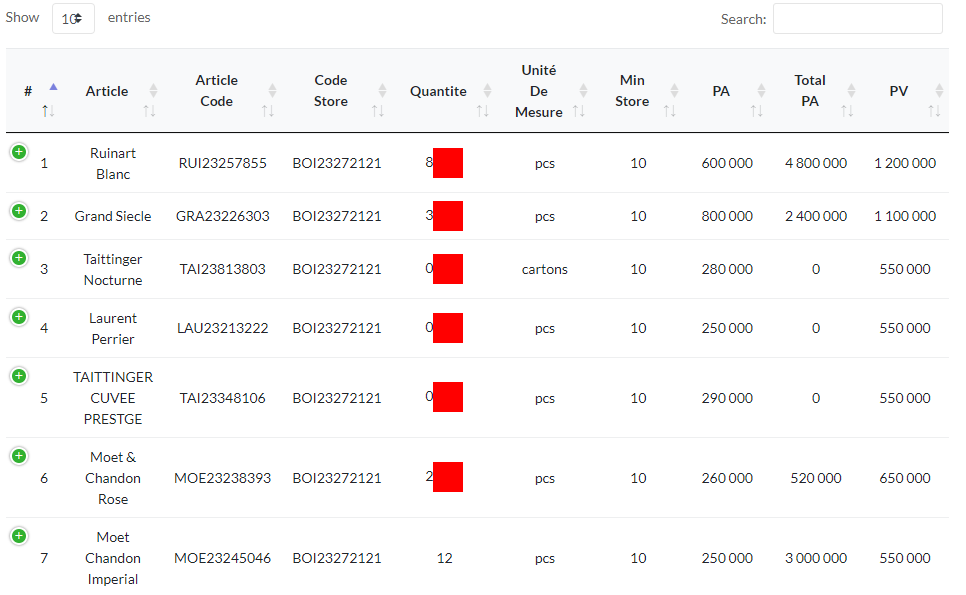
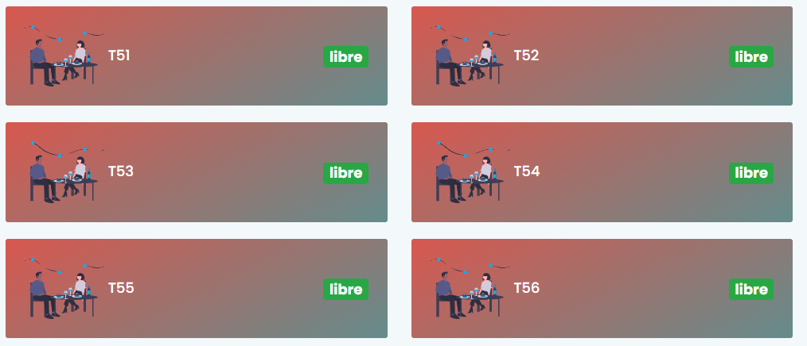
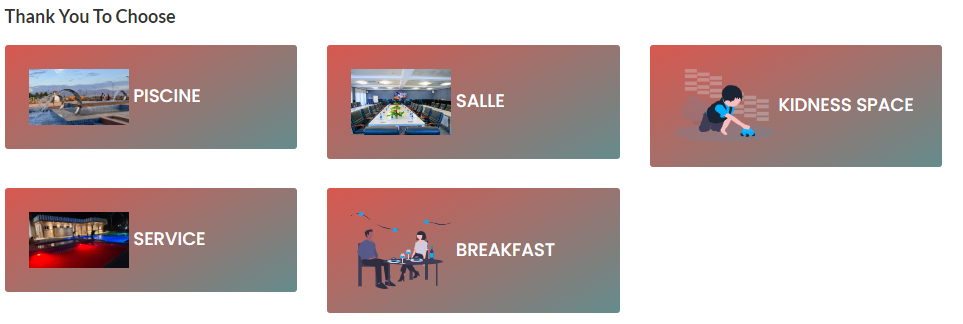
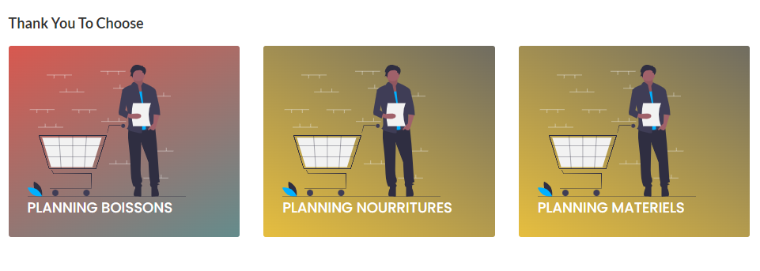

<br>

<br>
<br>
<br>
<br>
<br>
<h1>AKIWACU</h1>

				#AMBAZA MARCELLIN


					FONCTIONNALITES
					'''''''''''''''
			1.	Gestion des rôles et permissions ;
			2.	Gestion des stocks multiples;
			3.	Alerte des stocks ;
			4.	Notifications automatiques ;
			5.	Background jobs ;
			6.	Gestion de facturation électronique connectée au serveur de l’OBR ;
			7.	Gestion des crédits et recouvrement ;
			8.	Gestion des plannings d’approvisionnement ;
			9.	Gestion de la paie ;
			10.	Statistique du chiffre d’affaire par section ;
			11.	Etablissement des documents avec QR Code avec la signature électronique après chaque opération ;
			12.	Génération automatique des rapports.
			13.	Possibilité d’accéder à distance avec PC,smartphone,POS,smart watch,etc.


<h2>AKABIRYA:</h2>
		-SIMPLICITE
		-RAPIDITE
		-SECURITE

<h2>How To Install :</h2>
	## Requirements:<br>
- Laravel `7.x`<br>
- Spatie role permission package<br>
 <h2>step 1:</h2>
 	<span>	Go to project folder -
```console</span><br>
 	<span>-cd repository</span><br>
 	<span>-git clone </span><br>
 	<span>Install Laravel Dependencies -
```console <br>
composer install</span><br>
<span>
Create database called - `akiwacu`</span>
 <h2>step 2:</h2>


 <h2>step 3:</h2>
 	<span>-go to database file in config folder</span><br>
 	'connections' => [

        'sqlite' => [
            'driver' => 'sqlite',
            'database' => env('DB_DATABASE', database_path('database.sqlite')),
            'prefix' => '',
        ],

        'mysql' => [
            'driver' => 'mysql',
            'host' => env('DB_HOST', '127.0.0.1'),
            'port' => env('DB_PORT', '3306'),
            'database' => env('DB_DATABASE', 'akiwacu'),
            'username' => env('DB_USERNAME', 'root'),
            'password' => env('DB_PASSWORD', ''),
            'unix_socket' => env('DB_SOCKET', ''),
            'charset' => 'utf8mb4',
            'collation' => 'utf8mb4_unicode_ci',
            'prefix' => '',
            'strict' => false,
            'engine' => null,
        ],

        'pgsql' => [
            'driver' => 'pgsql',
            'host' => env('DB_HOST', '127.0.0.1'),
            'port' => env('DB_PORT', '5432'),
            'database' => env('DB_DATABASE', 'forge'),
            'username' => env('DB_USERNAME', 'forge'),
            'password' => env('DB_PASSWORD', ''),
            'charset' => 'utf8',
            'prefix' => '',
            'schema' => 'public',
            'sslmode' => 'prefer',
        ],

        'sqlsrv' => [
            'driver' => 'sqlsrv',
            'host' => env('DB_HOST', 'localhost'),
            'port' => env('DB_PORT', '1433'),
            'database' => env('DB_DATABASE', 'forge'),
            'username' => env('DB_USERNAME', 'forge'),
            'password' => env('DB_PASSWORD', ''),
            'charset' => 'utf8',
            'prefix' => '',
        ],

        'dusk_testing' => [
            'driver' => 'sqlite',
            'database' => database_path('database.sqlite'),
            'prefix' => '',
        ],

    ],

   <h2>step 4 : </h2>
    <h3>run the following commands:</h3>
    	*php artisan migrate<br>
    	*php artisan db:seed<br>
    	*php artisan serve <br>
    	*Username - superadmin<br>
		*password - ambazamarcellin@2001